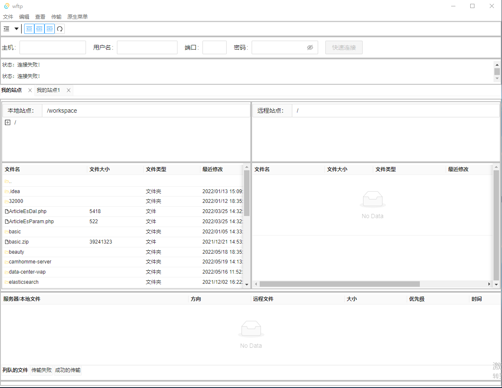

# wftp

## Project setup
```
npm install
```

### Compiles and hot-reloads for development
```
npm run tauri:serve
```
### Compiles and minifies for production
```
npm run tauri:build
```

## Todo List
  - [ ] 菜单
    - [x] 页面
    - [ ] 功能实现
      - [ ] 文件  
      - [ ] 编辑  
      - [ ] 查看  
      - [ ] 传输  
      - [x] 原生菜单  
### FTP协议支持
  - [x] 支持多个连接  
  - [x] 远程站点列表
    - [ ] 下载
    - [x] 进入目录 
    - [x] 创建文件
    - [x] 创建目录 
    - [x] 重命名 
    - [x] 删除 
    - [x] 刷新 
    - [x] 复制URL链接到剪贴板 
    - [ ] 文件权限 
    - [ ] 查看/编辑 
    - [ ] 远程站点不支持Utf-8 
  - [x] 本地站点列表
    - [x] 上传
    - [x] 进入目录 
    - [x] 创建文件
    - [x] 创建目录 
    - [x] 重命名 
    - [x] 删除 
    - [x] 刷新 
    - [ ] 查看/编辑 
  - [x] 状态列表
  - [ ] 本地站点/远程站点树结构
  - [x] 站点管理器
    - [x] 我的站点树结构
      - [x] 新站点
      - [ ] 新文件夹
      - [x] 重命名
      - [x] 删除
      - [x] 复制
    - [x] 常规
    - [ ] 高级
    - [ ] 传输设置
    - [ ] 字符集

### SFTP协议支持  
- [ ] 暂无
### Storj协议支持  
- [ ] 暂无


## ScreenShot

 